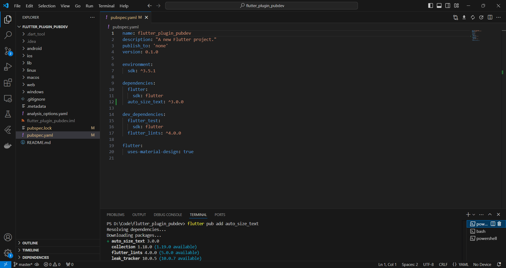

# Praktikum
## Langkah 1

## Langkah 2

## Langkah 3

## Langkah 4

## Langkah 5

## Langkah 6

# Tugas Praktikum

## 2.
Untuk menambah dan menginstall dependency auto_size_text

## 3.
Untuk menambah parameter pada konstruktor widget

## 4.
RedTextWidget dan Text biasa, RedTextWidget menggunakan autosizetext yang dimana text akan diubah ukurannya hingga pas dengan kontainer nya

## 5.
- minFontSize: menentukan ukuran minimal
- maxFontSize: menentukan ukuran maksimal
- textAlign : posisi text secara horizontal
- maxLines : jumlah maksimal baris teks saat dibentangkan
